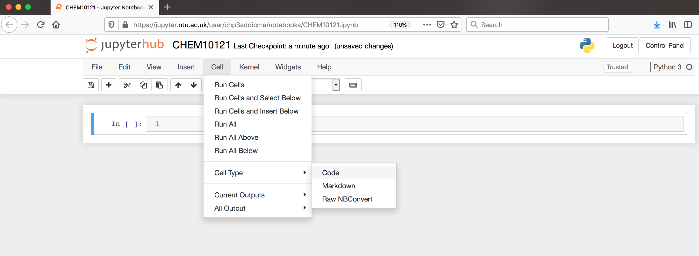
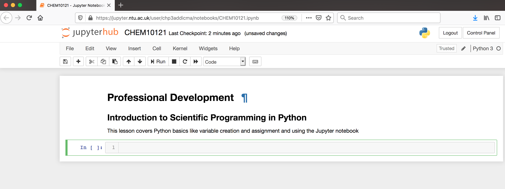
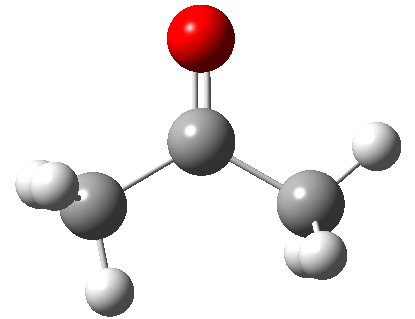
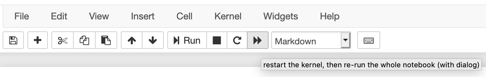

## Getting Started
Python is a computer programming language that has become ubiquitous in scientific programming.  Our initial lessons will run python *interactively* through a python interpreter. We will first use a Jupyter notebook.  The [setup] page should have provided information
on how to install and start a Jupyter notebook.  Everything included in a code block is something you could type into your python interpreter and evaluate.

### Setting up your Jupyter notebooks
In the [setup], you learned how to start a Jupyter notebook. Now, we will use the notebook to execute Python code. Jupyter notebooks are divided into cells. You run a Jupyter notebook one cell at a time. To execute a cell, click inside the cell and press `shift+enter`.

In the upper left corner, click where it says "Untitled" and change the name to "Introduction to Python". We have now changed the name of the Jupyter Notebook.

Jupyter notebooks allow us to also use something called **markdown** in some cells. We can use markdown to write descriptions about our notebooks for others to read. It's a good practice to have your first cell be markdown to explain the purpose of the notebook. Let's do that in our first cell. Click inside the first cell, then on the top of the screen select `Cell->Cell Type->Markdown` (shown below).



Now, return to the cell and type the following:

~~~
# Professional Development
## Introduction to Scientific Programming in Python

This lesson covers Python basics like variable creation and assignment and using the Jupyter notebook
~~~
{: .language-markdown}

In Markdown, we create headers using a single `#` sign. Using two (`##`) creates a subheader. After typing this into a cell, press `shift+enter` to evaluate. Now your notebook should look like the following.



In the setup, you uploaded a zipfile with some data files you'll be using in these lessons, to unzip that file ready for use, copy and paste the following (including all punctuation) in the next cell of your notebook:

~~~
! unzip ~/CHEM10121_python_datafiles.zip -d ~/
~~~


Now that our notebook is set-up, we're ready to start learning some Python!

## Saying Hello

The very first thing we'll do (because it's obligatory) is get python to say Hello to us. Type the following into the next cell of your Jupyter notebook.

```
print("Hello World!")
```
{: .language-python}

```
Hello world!
```
{: .output}

Now let's unpack what we did there:<br>
Highlighted in green is the `print()` function. The print function tells python to print something to the screen. "Something" can be almost anything. The parentheses gather all the stuff that we're sending to the print function. There are extra options we can use if we want to do something special (e.g. print to a file). A place with a whole pile of examples is [here](https://realpython.com/python-print/).<br>
The final thing to note is that we used quotation marks to supply the *string* Hello World! as an *argument* to the print function. Why do you think we did that? What else could python think Hello World! was?

## Variables
Let's *assign* the string Hellow World! to a *variable*:
```
greeting = "Hello World!"
```
{: .language-python}

The syntax for assigning variables is the following:
~~~
variable_name = variable_value
~~~
{: .language-python}

> ## Check your Understanding
>
> What is printed by each of the following two statements? 
> ~~~
> print("greeting")
> print(greeting)
> ~~~
> {: .language-python}
>
>> ## Answer
>>
>> ~~~
>> greeting
>> Hello World!
>> ~~~
>> {: .output}
> {: .solution}
{: .challenge}

* Variables can be strings, numbers, lots of other things
* Variable names can be (almost!) anything, but they should be readable. Think about reading your code later - "temperature_in_C"
is informative, "t" is not.
* You can use any letter, any number and the underscore character
* In python, the name does not dictate the type of the data

## Assigning variables and data types

Now let's start working with some numbers. Any python interpreter can work just like a calculator.  This is not very useful. Type the following into the next cell of your Jupyter notebook.

```
3 + 7
```
{: .language-python}

```
10
```
{: .output}

Here, Python has performed a calculation for us. To save this value, or other values, we assign it to a variable for later use.

Now let's try a real calculation. Type the following into the next cell of your Jupyter notebook.
```
deltaH = -541.5   #kJ/mole
deltaS =  10.4     #kJ/(mole K)
temp = 298      #Kelvin
deltaG = deltaH - temp * deltaS
```
{: .language-python}

Notice several things about this code.  The lines that begin with `#` are comment lines.  The computer does not do anything with these comments.  They have been used here to remind the user what units each of their values are in. Comments are also often used to explain what the code is doing or leave information for future people who might use the code.  

We can now access any of the variables from other cells. Let's print the value that we calculated. In the next cell,

~~~
print(deltaG)
~~~
{: .language-python}

```
-3640.7000000000003
```
{: .output}

At the beginning of this episode, we introduced the `print()` function.  Often, we will use the print function just to make sure our code is working correctly.

Note that if you do not specify a new name for a variable, then it doesn't automatically change the value of the variable; this is called being *immutable*.  For example if we typed
```
print(deltaG)
deltaG * 1000
print(deltaG)
```
{: .language-python}
```
-3640.7000000000003
-3640.7000000000003
```
{: .output}

Nothing happened to the value of `deltaG`.  If we wanted to change the value of `deltaG` we would have to re-save the variable using the same name to overwrite the existing value.
```
print(deltaG)
deltaG = deltaG * 1000
print(deltaG)
```
{: .language-python}
```
-3640.7000000000003
-3640700.0000000005
```
{: .output}

There are situations where it is reasonable to overwrite a variable with a new value, but you should always think carefully about this.  Usually it is a better practice to give the variable a new name and leave the existing variable as is.  
```
print(deltaG)
deltaG_joules = deltaG * 1000
print(deltaG)
print(deltaG_joules)
```
{: .language-python}
```
-3640700.0000000005
-3640700.0000000005
-3640700000.0000005
```
{: .output}

## Assigning multiple variables at once
Python can do what is called multiple assignment where you assign several variables their values on one line of code.  The following code block does the exact same thing as the previous code block.

```
#I can assign all these variables at once
deltaH, deltaS, temp = -541.5, 10.4, 298
deltaG = deltaH - temp * deltaS
print(deltaG)
```
{: .language-python}

```
-3640.7000000000003
```
{: .output}

## Data types
Each variable is some particular type of data.  The most common types of data are strings (`str`), integers (`int`), and floating point numbers (`float`).  You can identify the data type of any variable with the function `type(variable_name)`.
```
type(deltaG)
```
{: .language.python}
```
float
```
{: .output}
You can change the data type of a variable like this.  This is called casting.
```
deltaG_string = str(deltaG)
type(deltaG_string)
```
{: .language-python}
```
str
```
{: .output}

## Lists
Another common data structure in python is the list.  Lists can be used to group several values or variables together, and are declared using square brackets [ ]. List values are separated by commas. Python has several built in functions which can be used on lists. The built-in function `len` can be used to determine the length of a list. This code block also demonstrates how to print multiple variables.
```
# This is a list
energy_kcal = [-13.4, -2.7, 5.4, 42.1]
# I can determine its length
energy_length = len(energy_kcal)

# print the list length
print('The length of this list is', energy_length)
```
{: .language-python}

```
The length of this list is 4
```
{: .output}

If you want to operate on a particular element of the list, you use the list name and then put in brackets which element of the list you want.  **In python counting starts at zero.  So the first element of the list is `list[0]`**

```
# Print the first element of the list
print(energy_kcal[0])
```
{: .language-python}

```
-13.4
```
{: .output}

You can use an element of a list as a variable in a calculation.  
```
# Convert the second list element to kilojoules.
energy_kilojoules = energy_kcal[1] * 4.184
print(energy_kilojoules)
```
{: .language-python}

```
-11.296800000000001
```
{: .output}

## Adding, subtracting and multiplying lists
Let's test what we can do with lists. Start with two simple lists:
```
first_list = [3, 4, 7]
second_list = [2, 5, 1]
print(first_list + second_list)
```
{: .language-python}

```
[3, 4, 7, 2, 5, 1]
```
{: .output}

Adding lists together works the way we expect.

```
print(first_list - second_list)
```
{: .language-python}

```
---------------------------------------------------------------------------
TypeError                                 Traceback (most recent call last)
<ipython-input-28-2766c15298c3> in <module>
      1 first_list = [3, 4, 7]
      2 second_list = [2, 5, 1]
----> 3 print(first_list - second_list)

TypeError: unsupported operand type(s) for -: 'list' and 'list'
```
{: .error}
But subtracting lists does not.
```
print(first_list * second_list)
```
{: .language-python}

```
---------------------------------------------------------------------------
TypeError                                 Traceback (most recent call last)
<ipython-input-29-b239fdefe9ad> in <module>
      1 first_list = [3, 4, 7]
      2 second_list = [2, 5, 1]
----> 3 print(first_list * second_list)

TypeError: can't multiply sequence by non-int of type 'list'
```
{: .error}
We can't multiply two lists either.

```
my_number = 3
print(first_list * my_number)
```
{: .language-python}

```
[3, 4, 7, 3, 4, 7, 3, 4, 7]
```
{: .output}
But we can multiply a list by an integer.

## pop() and append()
Python has two other important functions that act on lists, `pop()` and `append()`. Try them out to learn what they do. Print the list and the value each time:

> ## Try it out
>
> ~~~
> print(first_list)
> my_value = first_list.pop()
> print('my_value is:', my_value)
> print('The list is now', first_list)
> print('The length of this list is', len(first_list))
> first_list.append(8)
> print('The list is now', first_list)
> print('The length of this list is', len(first_list))
> ~~~
> {: .language-python}
>
>> ## Answer
>>
>> ~~~
>> [3, 4, 7]
>> My_value is: 7
>> The list is now [3, 4]
>> The length of this list is 2
>> The list is now [3, 4, 8]
>> The length of this list is 3
>> ~~~
>> {: .output}
> {: .solution}
{: .challenge}


## Slices
Sometimes you will want to make a new list that is a subset of an existing list.  For example, we might want to make a new list that is just the first few elements of our previous list.  This is called a `slice`.  The general syntax is
```
new_list = list_name[start:end]
```
{: .language-python}

When taking a slice, it is very important to remember how counting works in python.  Remember that counting starts at zero so the first element of a list is `list_name[0]`.  When you specify the last element for the slice, it goes *up to but not including* that element of the list.  So a slice like
```
short_list = energy_kcal[0:2]
```
{: .language-python}
includes energy_kcal[0] and energy_kcal[1] but *not* energy_kcal[2].
```
print(short_list)
```
{: .language-python}
```
[-13.4, -2.7]
```
{: .output}

If you do not include a start index, the slice automatically starts at `list_name[0]`.  If you do not include an end index, the slice automatically goes to the end of the list.  

> ## Check your Understanding
>
> What does the following code print?
> ~~~
> slice1 = energy_kcal[1:]
> slice2 = energy_kcal[:3]
> print('slice1 is', slice1)
> print('slice2 is', slice2)
> ~~~
> {: .language-python}
>
>> ## Answer
>>
>> ~~~
>> slice1 is [-2.7, 5.4, 42.1]
>> slice2 is [-13.4, -2.7, 5.4]
>> ~~~
>> {: .output}
> {: .solution}
{: .challenge}

If you don't specify a new variable name nothing happens. Looking at our example above if we only type
```
print(energy_kcal)
energy_kcal[0:2]
print(energy_kcal)
```
{: .language-python}
nothing happens to `energy_kcal`.
```
[-13.4, -2.7, 5.4, 42.1]
[-13.4, -2.7, 5.4, 42.1]
```
{: .output}


## Dictionaries
Lists are great for keeping, well, *lists*. Let's say you had a shopping list:<br>
* flour
* eggs
* milk
* chocolate
* butter

But what if you have a recipe: <br>

| Ingredient | Amount | 
|----------- | ---- |
| flour      | 2  |
| eggs       | 2 | 
| milk       | 1 |
| chocolate  | 0.75 |
| butter     | 0.5 |

The amount of each ingredient is associated with the ingredient. **Dictionaries** are a way that python provides to keep variables together with their meanings. Because each *value* is associated with a *key*, some other languages call this construct an *associative array*. <br>
Dictionaries are declared using braces { }. Key and value pairs are separated by commas. Like lists, python has several built in functions which can be used on dictionaries. The built-in function `len` can be used to determine the length of a dictionary. Dictionaries don't have an order, you access the values by their key:

~~~
famous_chemists = {
"given_name": "Bettye",
"family_name": "Washington Greene",
"vintage": 1935
}
print(famous_chemists)
~~~
{: .language-python}
```
{'given_name': 'Bettye', 'family_name': 'Washington Greene', 'vintage': 1935}
```
{: .output}

We can add to a dictionary:
~~~
famous_chemists["university"] = "Wayne State University"
print(famous_chemists)
~~~
{: .language-python}
```
{'given_name': 'Bettye', 'family_name': 'Washington Greene', 'vintage': 1935, 'university': 'Wayne State University'}
```
{: .output}
Let's check the length of the dictionary:
```
print(len(famous_chemists))
```
{: .language-python}
```
4
```
{: .output}

Now, this dictionary actually only describes a single chemist. A collection of famous chemists might be represented in python as a **list of dictionaries** or a **dictionary of dictionaries**

### How to describe an atom?
Below is depicted the acetone molecule. Think about how you would describe one of the carbon atoms using a python dictionary:



> ## Design an atom homework
> Design a dictionary that you could use to describe an atom. Think about the how to distinguish between the three carbon atoms in acetone and write a dictionary for each of the three carbon atoms. For now, make up any values you can't guess.
> ~~~
> atom = {
> }
> ~~~
> {: .language-python}
>> ## Hints
>> Consider how the left hand side carbon will differ from the central carbon. <br>
>> What do you need to differentiate between the left hand side carbon and the one on the right? <br>
> {: .solution}
{: .challenge} 


## A note about jupyter notebooks
If you use the jupyter notebook for your python interpreter, the notebook only executes the current code block.  This can have several unintended consequences. If you change a value and then go back and run an earlier code block, it will use the new value, not the first defined value, which may give you incorrect analysis.  Similarly, if you open your jupyter notebook later, and try to run a code block in the middle, it may tell you that your variables are undefined, even though you can clearly see them defined in earlier code blocks.  But if you didn't re-run those code blocks, then python doesn't know they exist. The same thing will occur if you save and close your notebook then reopen it. To rerun everything you've entered into a notebook, use the "fast forward" button at the top of the screen.

 


