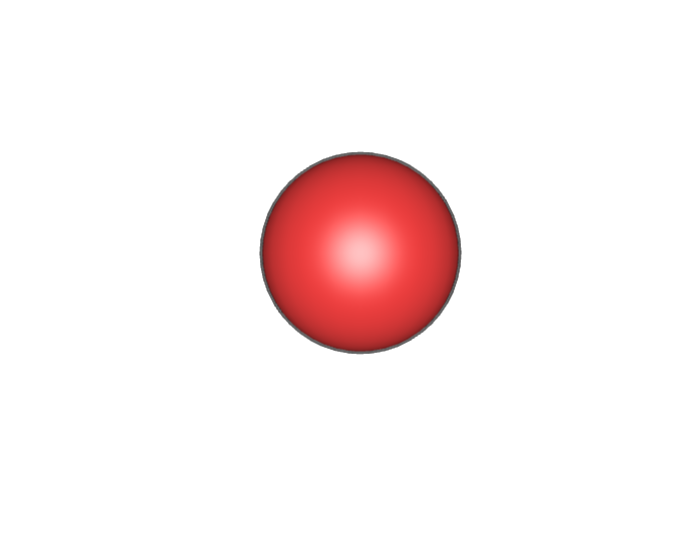

## Atomic Simulation Environment

The [Atomic Simulation Environment (ASE): https://wiki.fysik.dtu.dk/ase/](https://wiki.fysik.dtu.dk/ase/) is a tremendously powerful set of tools and Python modules for setting up, manipulating, running, visualizing and analyzing atomistic simulations.

## Atoms in the ASE
In episode 1, you wrote python dictionaries to describe the three carbon atoms in acetone. You might have come up with something like this:

~~~
atom ={
"atomic number": 6
"atomic symbol": "C"
"isotope": 12
"charge": 0
"position": [0.0, 0.0, 0.0] 
}
~~~
{: .language-python}

ASE provides an **Atom object** to store and manipulate atoms in chemical simulations. The **Atom object** is a python class defined [here](https://wiki.fysik.dtu.dk/ase/ase/atom.html). Compare the data types of the `Atom` parameters with your dictionary.

Just like floats or strings can be put into lists, ASE also defines a collection of atoms. The **Atoms object** is defined [here](https://wiki.fysik.dtu.dk/ase/ase/atoms.html)

Let's make up a simple molecule (a.k.a. **Atoms object**) and view it:

~~~
from ase import Atoms
d = 1.1
co = Atoms('CO', positions=[(0, 0, 0), (0, 0, d)])
from ase.visualize import view
view(co, viewer='x3d')
~~~
{: .language-python}

This will bring up a viewer in you your Jupyter notebook, you can rotate the molecule using the mouse.

Let's read in a more complex molecule: From the NOW page, the file ``caffeine.xyz`` should have been downloaded with all the files for this course:

~~~
from ase.io import read, write
caffeine = read("caffeine.xyz")
view(caffeine, viewer='x3d')
~~~
{: .language-python}

The ASE has internally defined many methods to read (and to write) common chemical formats. When you use the `read` function that you imported from `ase.io`, it determed the filetype from its extension (xyz) and uses the appropriate function to read the file and return an **Atoms object**.

You can also read and view the Cu(OH)2 crystal you used in an earlier episode:

~~~
cuoh = read("CuOH.cif")
view(cuoh, viewer='x3d')
~~~
{: .language-python}

## Manipulating molecules
As you saw above, when you created a CO molecule, ASE allows you to manipulate the positions of atoms directly. There are many methods that can be used on Atoms objects, they are all listed, with examples [here](https://wiki.fysik.dtu.dk/ase/ase/atoms.html).
Let's look at two water molecules:
~~~
two_waters = read("2_h2o.xyz")
view(two_waters, viewer='x3d')
~~~
{: .language-python}

You might want to look at the molecule using a full molecular viewer (e.g. the free, open-source [IQMol](http://iqmol.org/)) to see how the two water molecules are arranged, but we can also do this in python:

~~~
print(two_waters.symbols)
print(two_waters.positions)
~~~
{: .language-python}
~~~
OH2OH2
[[ 0.        0.        0.      ]
 [-0.223085 -0.94174   0.      ]
 [ 0.976851  0.        0.      ]
 [ 2.895318  0.        0.      ]
 [ 3.095395  0.561093  0.765582]
 [ 3.095395  0.561093 -0.765582]]
~~~
{: .output}

So the first atom is an oxygen atom at position [0.0, 0.0, 0.0], the next two atoms are hydrogen atoms, the fourth atom (index = 3 in python!) is an oxygen atom with coordinates of [2.895318, 0.0, 0.0]. We could print this information more clearly using a loop:

~~~
for atom in two_waters:
    print(atom.symbol, atom.position)
~~~
{: .language-python}
~~~
O [0. 0. 0.]
H [-0.223085 -0.94174   0.      ]
H [0.976851 0.       0.      ]
O [2.895318 0.       0.      ]
H [3.095395 0.561093 0.765582]
H [ 3.095395  0.561093 -0.765582]
~~~
{: .output}

To move the second water molecule away from the first, we can `translate` the last three atoms. If we decide to translate the molecule along the x-axis, we can simply increase the x-coordinate of the second molecule (half of the **Atoms object**):

~~~
translation = 2.0
two_waters.positions[3:] += ([translation, 0.0, 0.0])
for atom in two_waters:
    print(atom.symbol, atom.position)
view(two_waters, viewer='x3d')
~~~
{: .language-python}
~~~
O [0. 0. 0.]
H [-0.223085 -0.94174   0.      ]
H [0.976851 0.       0.      ]
O [6.895318 0.       0.      ]
H [7.095395 0.561093 0.765582]
H [ 7.095395  0.561093 -0.765582]
~~~
{: .output}
The molecule shown in the viewer looks different from before, but it is hard to tell from the viewer that we've changed the molecule, though we can see from the printed coordinates that we have indeed changed them. Let's write out the new molecule, so we can view it in IQmol:

~~~
new_waters = '2_h2o_new.xyz'
write(new_waters, two_waters)
~~~
{: .language-python}
This command won't appear to do anything, but you should have a new file called `2_h2o_new.xyz` in your directory. Open it, either as a text file, or in IQmol and compare it to the original file that you read in.

We can also determine (`get_`) and change (`set_`) angles and dihedral angles. Dihedral angles are also called torsions, if you've not heard of a dihedral angle before, a good explanation is [here](https://chem.libretexts.org/Bookshelves/Ancillary_Materials/Reference/Organic_Chemistry_Glossary/Dihedral_Angle).

~~~
two_waters = read("2_h2o.xyz")
original_dihedral = two_waters.get_dihedral(1,0,3,5)
print(original_dihedral)
two_waters.set_dihedral(1,0,3,5,240,[0,0,0,1,1,1])
view(two_waters, viewer='x3d')
~~~
{: .language-python}
The output will show the dihedral angle to far too many decimal places (1 is enough) and then will show the molecule viewer, where you verify that the second water molecule is now in a different orientation compared to the molecule you read in:
~~~
126.23758921152063
~~~
{: .output}
If you'd like to make absolutely certain that you've changed the molecule, write it out to a new file and view it in IQmol.

## Setting up a calculator
ASE can also act as an interface to several computational chemistry programs that can optimise the geometry of the molecule, determine the vibrational (IR) spectrum of the molecule and simulate the molecule over time by running molecular dynamics, amongst many other things. A `calculator` in ASE is an interface to one of these programs that sends the **Atoms object** to the program and (after some time, which may be less than a second, or even up to several hours), receives some information back from the program. The most common piece of information for a calculator to return, is a **potential energy** and we'll focus on that in this episode. To use an ASE calculator, we first have to import it, set it up and attach it to our **Atoms object**. For this example, we'll use a very straightforward calculator, designed especially for water, called TIP4P.

~~~
#Import
from ase.calculators.tip4p import TIP4P
#Setup calculator, TIP4P doesn't need any options, so we just need to define it
calc = TIP4P()
#Read in molecule to a new Atoms object
two_waters = read("2_h2o.xyz")
#Attach the calculator to our Atoms object
two_waters.set_calculator(calc)
print(two_waters.get_potential_energy())
~~~
{: .language-python}
~~~
-0.266677737333415
~~~
{: .output}
The output is the energy of the two water molecules in electron Volts (eV). 
> ## Exercise
>
> Determine the optimal distance and the binding energy of the two water molecules. Change the distance between the molecules between [-0.5:1.5] Angstrom in 0.01 Angstrom increments.
>> ## Answer
>> ~~~
>> from ase.calculators.tip4p import TIP4P
>> calc = TIP4P()
>> # Set up empty lists for energies and distances
>> energies = []
>> distances = []
>> # We're asked to determine the distance at the minimum energy, so setup variables for minimum energy and distance
>> minimum_energy = 0.0
>> optimum_distance = 0.0
>> # Now read the molecule
>> two_waters = read("2_h2o.xyz")
>> # Find out the initial distance between the two waters
>> initial_H_bond_length = two_waters.get_distance(2,3)
>> print(F'Initial Hydrogen bond distance read in from file = {initial_H_bond_length} Angstrom')
>> # Now we need a loop to change the distance between the two water molecules and calculate the energy each time
>> for distance in range(-50,150):
>>     molecule = two_waters.copy() #Use a copy of the molecule to make sure we get exactly the distance we want
>>     molecule.set_calculator(calc)
>>     molecule.positions[3:] += ([distance * 0.01, 0.0, 0.0])
>>     distances.append(initial_H_bond_length + distance * 0.01)
>>     energies.append(molecule.get_potential_energy())
>>     #Now check if our energy is less than our current minimum energy:
>>     if molecule.get_potential_energy() < minimum_energy:
>>         minimum_energy = molecule.get_potential_energy()
>>         optimum_distance = initial_H_bond_length + distance * 0.01
>>     
>> print(F'Optimal Hydrogen bond distance (TIP4P) = {optimum_distance} Angstrom')
>> print(F'Binding energy at that distance = {minimum_energy} eV' )
>> ax = plt.gca()
>> ax.plot(distances, energies)
>> ax.set_xlabel('Distance [Å]')
>> ax.set_ylabel('Total energy [eV]')
>> plt.show()
>> ~~~
>> {: .language-python}
> {: .solution}
{: .challenge}


