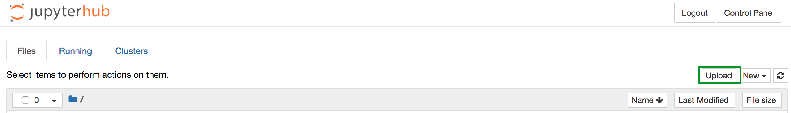
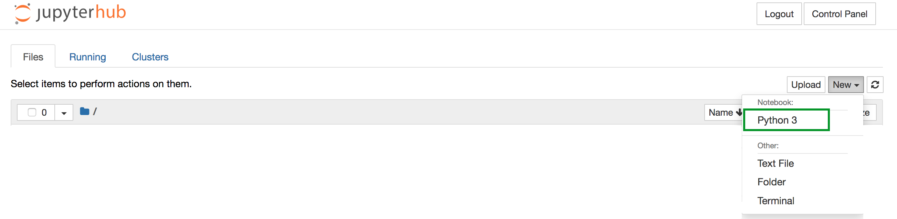

##
[Python](https://python.org/) is a popular language for scientific computing, and great for general-purpose programming as well. Python is free and open-source and it works on Windows, Mac and Linux. For this course, NTU has a python server which we will use:

Log on to the [Jupyter server](https://jupyter.ntu.ac.uk) using your NTU credentials

## Obtain lesson materials and begin a new notebook
1. These lessons will read a number of data files, which you can obtain from the NOW page, or [here](https://github.com/maddicoat/CHEM10121/blob/gh-pages/CHEM10121_python_datafiles.zip)
2. Upload the folder to the Jupyter server 

3. Open a notebook.


